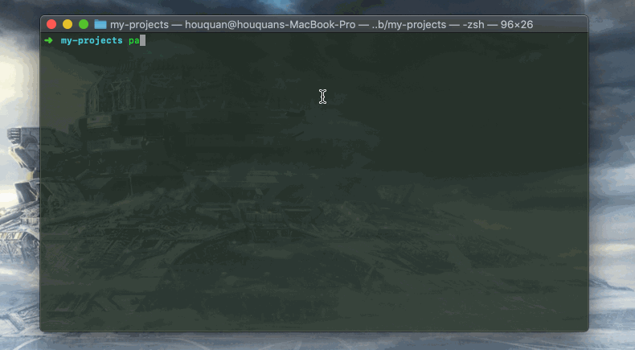

# pandora-cli

[](https://badge.fury.io/js/pandora-cli)

这是一款能提升程序员幸福感的 CLI 工具！！！

啪（pa）一下，你就可以完成你的项目搭建编译 ~~

`pandora-cli` 旨在提供统一的开发入口，集成所有在软件生命周期中需要的所有功能，比如初始化各种项目（web, node, 小程序，工具项目），构建，创建样板代码，联调，部署等等 ...

我们不需要再为记不住各种 cli 工具命令以及各个命令的参数而烦恼，比如：项目初始化时，用 yo, 构建时使用 webpack-cli gulp 等等，发布时使用有使用自定义的脚本等等。

聪明的你可能早就想到，都注册为 npm scripts 不就好了么？没错，但是项目初始化你还是需要使用其他的 cli 工具的，如果你能接受这一点，你可能并不需要使用 `pandora-cli`. 但 `pandora-cli` 能做的却绝不仅仅是集成了项目初始化的脚本。

## 使用

全局安装（**推荐**）：

```bash
  npm i -g pandora-cli

  pa start
```

或者，本地安装：

```bash
  npm i -D pandora-cli

  npx pa start
```

> 安装成功后，我们就可以使用 `pa` 提供的功能来流畅的进行项目的开发了。

## Pandora-cli（`pa`） 能做什么？

### 在新项目需求确定后，我们可以使用 `pa` 快速床架一个新的项目，当然我们可以使用内置的项目脚手架来选择要初始的项目类型

```bash
  # 直接创建项目 <project-name> 为你需要输入的项目名
  pa init <project-name>
  cd <project-name>

  # 或者你已经创建好了一个目录
  cd <project-name>
  pa init .
```

接下来就会列出 `pa` 目前支持的脚手架列表，供你选择。选择好脚手架后开始初始化项目，完成后自动开始安装依赖。


### 启动开发环境 `pa start`

```bash
  # pa start 其实是一个 command hook, 每次执行的其实是项目脚手架中提供的对应的构建脚本
  pa start
```

pa start 会开启监听模式，在此模式下，我们修改的文件都会触发实时构建。



### 构建生产包 `pa build`

```bash
  # pa build 命令也是一个 command hook
  pa build --env prod
```

`--env` 用来指定需要构建的环境，可用的值为 `test`, `pre`, `prod`, 分别对应的是测试环境，预发环境，生产环境，对应的配置，我们可以到对应的脚手架文档中查看。

> `pa build` 不会进入监听（watch）模式

### 发布（仅小程序项目支持）`pa release`

```bash
  # pa release 命令也是一个 command hook
  pa release patch -m <comments>
```

`pa release` 目前只有小程序脚手架才支持，用来将构建好的小程序推送到小程序控制后台。

### 安装依赖 `pa install` 或者 `pa i`

```bash
  # 此命令在小程序项目中和非小程序项目中的表象不一致

  # 在小程序项目中，使用 p i 用来安装小程序组件
  pa i dialog

  # 也可以通过 `--npm` 来指定安装 npm 包
  pa i jsencrypt --npm

  # 非小程序项目中，pa i 就是 npm i 的一个桥接，使用使用者系统的全局 npm
  pa i jsencrypt

  # 或者执行项目依赖安装
  pa i
```


### 创建样板代码 `pa create` 或者 `pa i`

```bash
  # 创建文件
  pa c src/index.js

  # 创建文件夹目录
  pa c page home
```

> 样板代码是可以自己配置的，具体的可以参考项目脚手架中 `.pandora/templates` 以及参考配置 `.pandora.conf.json` 中的 `templates` 字段


更多命令可以参考 [Pandora-cli 命令详解](./docs/commands.md)

## More contents

- [Pandora-cli 命令详解](./docs/commands.md)

- [如何使用 pandora-cli 来开发微信小程序](./docs/how-to-develop-minprogram-with-pandora.md)

- [如何开发为 pandora-cli 开发一个项目脚手架](./docs/how-to-develop-a-boilerplate-for-pandora.md)

- [.pandora.conf.json 配置详解](./docs/configuration.md)

- [使用 pandora-cli 完成对小程序的持续集成](./docs/how-to-intergre-miniprogram-into-jenkins-via-pandora.md)

## 彩蛋

使用 `pa` 一下觉得没意思？那 `pia` 一下呢？ 那 `papapa` 呢 ~~~ 总有一款姿势满足您的口味 ~~

## 贡献

有任何意见或建议请直接提交 issue 或 PR。您的任何帮助都会让我们开心很久。

## LICENSE

MIT License

Copyright (c) 2018 pandolajs

Permission is hereby granted, free of charge, to any person obtaining a copy
of this software and associated documentation files (the "Software"), to deal
in the Software without restriction, including without limitation the rights
to use, copy, modify, merge, publish, distribute, sublicense, and/or sell
copies of the Software, and to permit persons to whom the Software is
furnished to do so, subject to the following conditions:

The above copyright notice and this permission notice shall be included in all
copies or substantial portions of the Software.

THE SOFTWARE IS PROVIDED "AS IS", WITHOUT WARRANTY OF ANY KIND, EXPRESS OR
IMPLIED, INCLUDING BUT NOT LIMITED TO THE WARRANTIES OF MERCHANTABILITY,
FITNESS FOR A PARTICULAR PURPOSE AND NONINFRINGEMENT. IN NO EVENT SHALL THE
AUTHORS OR COPYRIGHT HOLDERS BE LIABLE FOR ANY CLAIM, DAMAGES OR OTHER
LIABILITY, WHETHER IN AN ACTION OF CONTRACT, TORT OR OTHERWISE, ARISING FROM,
OUT OF OR IN CONNECTION WITH THE SOFTWARE OR THE USE OR OTHER DEALINGS IN THE
SOFTWARE.
