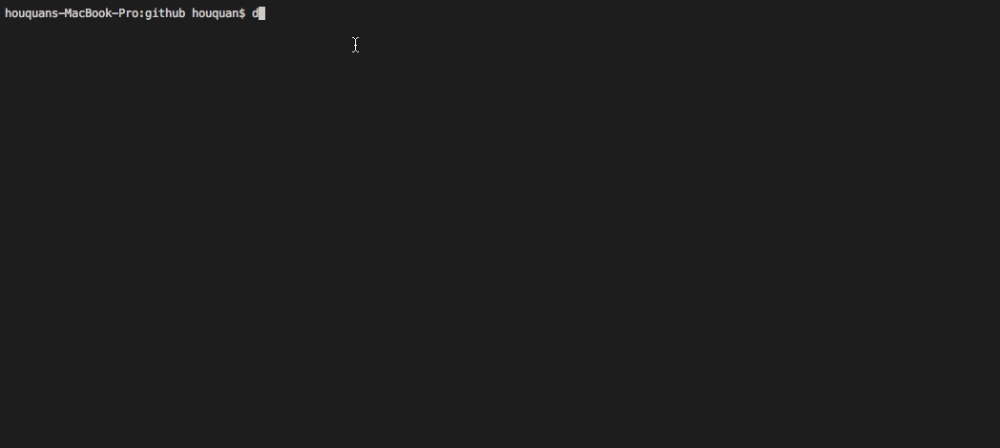
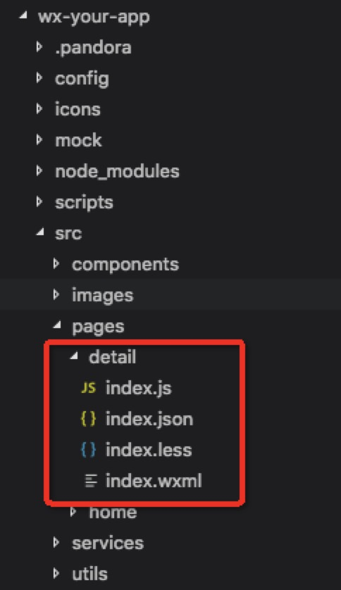
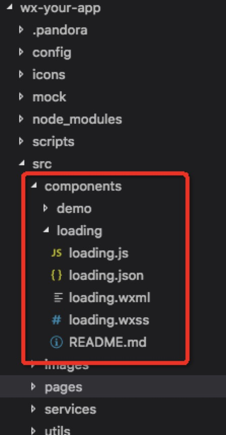

# 如何使用 pandora-cli 来开发小程序

从 2016 年小程序正式发布以来，小程序依托微信庞大的流量入口势如破竹般成长为继 HTML web, Native 之后的又一流派，这两年的发展中也不乏各种各样的小程序开发框架，工程化框架，明星框架如 WePY, Taro, mpvue，不知名的数不胜数。

### 接下来我们仔细说说为什么会出现这些框架？

那就要从小程序自身的问题说起，小程序自创一套 wxml 描述语言来标记页面结构，wxss 用来修饰页面接口，使用 javascript 来实现业务逻辑，映射到 html web 开发中，就和我们直接使用 html、css、js 来开发是一样的，开发效率极低，没有模块化，没有 less, sass, 为了提高开发效率这些框架也就应运而生，但也正是因为小程序与 html web 开发的相似度极高，也就让这些框架的开发者有了更大胆的想法，那就是 “write ones, build anywhere!”, 所以这些框架除了提供了小程序开发的工程化流程，同时也提供了一套编译系统，通过指定构建目标来编译出适配各个平台（web, miniapp, rn ...）的代码。同时考虑到 vue 和 react 在前端圈内的普及程度，所以这些明星框架们也都不约而同的在目标语言之上提供了一套仿 vue (WePY, mpvue) 和仿 react (Taro) 的 DSL。

### 那这些高级框架真的提高了我们的开发效率么？

这是毋庸置疑的，对于跨终端的需求来说，使用这些框架我们确实能达到使用原来 20% 的时间完成原来 80% 的需求，毕竟不用再开发多套代码了，从开发体验上来讲从 vue 或者 react 开发可以几乎无痛转过来，那么这些框架，或者说这些 DSL 的编译就没有问题么？当然不是，从目前各个库的 github 地址中，issue 数也是少则几十，多则上百，不少问题都是由于种种原因，如框架的初始设计仓促或者跨终端等等而难以解决，在使用的过程中不得不绕过，或者直接就 cut 掉一些原生平台的功能，这些问题或许都有一些 hack 办法来解决，如果面向多终端来看，这些问题其实是无伤大雅的，毕竟开发成本降低的不是一星半点，但是面对只有小程序开发的场景来看，对于这些问题的忍受其实就是多余的了，我们完全可以不用这些框架，在解决了小程序存在的工程化问题后直接使用原生来开发小程序，发挥小程序 100% 的能力岂不是更好？！

### 那小程序在工程化层面存在哪些问题？

- 直接编写样式，开发者工具不支持 less, sass 等预编译语言，开发效率低

- 不支持 npm 模块引用，使用时，必须手动下载并拷贝需要的依赖到项目中，同时所依赖还有依赖也需要一并拷贝到项目中，并修改引用为相对地址

- 不支持别名设置，必须相对路径，开发体验差不说，代码目录改动后，需要修改的地方会因为你所依赖的内容多而难以修改，容易出错

- 不支持三方自定义组件的自动安装与依赖分析，要不就直接在项目中开发，要不就从别的项目中复制拷贝，同时手动分析依赖

- 不支持 async / await 异步预发

- 不支持 dev / test / pre / prod 多环境的配置打包，面对不同环境的 api 需要手动修改以达到在不同环境下开发

- 不支持字体文件，虽然在 2.1.0 基础库后支持了 loadFontFace 的 api，兼容性差不说，字体文件也得提前生成好

### 那 pandora-cli 有解决这些问题么？

当然了，如果没有解决也就不会有这篇文章了~，但实际上并不是有 pandora-cli 来解决的，而是有其内置的小程序脚手架 `pandora-boilerplate-wechat` 来解决的。

pandora-cli 的目的是统一开发入口，提升程序员们的幸福指数。所以 pandora-cli 仅仅是一套命令行工具，提供了若干命令而已，所以他不仅仅可以用来开发小程序，也可以用来开发 react 项目，vue 项目，只需要开发好对应的项目脚手架即可。

真正解决上述问题是 pandora-boilerplate-wechat 这套脚手架框架的项目构建脚本。这套开发脚手架除了解决了上述列出来的问题外，没有引入任何额外的复杂度，我们依旧是直接使用小程序语法（除了把 wxss 换成了 less）来开发小程序即可，不会再出现什么莫名其妙的框架问题。

### 究竟如何使用 pandora-cli 来开发小程序呢？

第一步：下载 pandora-cli

```
  npm i -g pandora-cli
```

第二步：初始化项目

```
  pa init wx-your-app
```

然后按照提示一步一的进行，如下动图：


> 如果使用 pa init 的时候提供了项目名，那么直接就提示选择要初始化的项目脚手架，目前只实现了小程序的脚手架。如果你没有输入项目名，cli 会提示你输入。如果你要初始化的项目目录已经创建好了，你可以直接使用 `pa init .` 来初始化当前目录为小程序项目。

按照提示完成项目的初始化后，会自动安装项目中的依赖。

第三步：启动项目

```
  pa start
```

> 默认情况下我们会以 `dev` 环境启动项目，如果需要以其他环境启动，可以使用 --env 来制定环境值, 如：`pa start --env prod` --env 的可选值有 dev, test, pre, prod

至此，我们用三步就从零搭建并启动了一个小程序项目。

### pandora-cli 还能做什么？

你是不会天真的以为 pandora-cli 就只能做上面的三步吧？我们还提供了提高开发过程的一系列快捷方（zi）式（shi）

**创建样板代码**

开发小程序中，比较麻烦的还是创建自定义组件和页面，因为要创建 4 个文件，所以我们还提供了创建样板代码的命令：

```
  pa create page src/pages/detail
```

创建样板代码，如果样板代码是一个目录，在 create 命令后输入样板名，然后输入要创建的目录名（目录名也可以是路径）。

效果如下图：



结果如下：



如果要创建的是文件，create 命令后直接输入`文件名.文件扩展名` 即可，如：

```
  pa create index.js

  pa create test.less
```

> create 命令名太长？试试他的缩写... `pa c page detail`

创建组件

```
  pa create component dialog
```

项目模板不够用怎们办？

可以在项目的根目录中找到 `.pandora/templates` 直接在这里创建或者修改就好了。

在样板代码中可以使用如下全局变量：

```
  @{Description} 使用命令时输入的文件描述
  @{User} 系统中 git global 中的 user.name, 如果没有设置就是命令行中提示输入的名字，或者项目根目录中 .pandora-conf.json 的配置的
  @{Email} 系统中 git global 中的 user.name, 如果没有设置就是命令行中提示输入的名字，或者项目根目录中 .pandora-conf.json 的配置的
  @{Date} 系统当前的日期
```

### 使用我们准备好的组件库

安装组件，组件会被安装到 src/components 目录中

```
  pa install loading
```

效果如下：


安装后:



### 项目目录解释：

```
.
├── build.config.js                   // 构建的配置文件，用来配置 js 模块别名
├── config                            // 全局配置用
│   └── app.yaml
├── icons                             // 字体图标 svg 目录
├── mock                              // 接口 mock 
├── node_modules                      // node_modules 模块
├── package-lock.json
├── package.json
├── project.config.json
├── scripts                           // 构建脚本目录
└── src                               // 源码目录
    ├── app.js
    ├── app.json
    ├── app.wxss
    ├── components
    ├── images
    ├── pages
    ├── services
    └── utils
```

### 如何进行多环境配置

在项目根目录下 `config/app.yaml` 中进行配置，配置内容如下：

```
appId: 'wx-2322123123'
appName: 'wx-your-app'
version: '1.0.0'
development:
  env: 'development'
test:
  env: 'test'
preproduction:
  env: 'preproduction'
production:
  env: 'production'
```

通用的配置直接在根节点配置，如: appId, appName 等字段

各环境的配置分别置于对应环境节点下，如：env 字段

`pa start --env pre` 构建后，在 js 文件中

```
  import config from 'config'
```

此时 config 对象为：

```
{
  appId: 'wx-2322123123',
  appName: 'wx-your-app',
  version: '1.0.0',
  env: 'preproduction'
}
```

### 如何使用字体图标？

在项目根目录下 `icons`, 将图标的 svg （可以是设计师提供，也可以从 icon-font 下载）置于其中，构建时自动完成，svg 命名格式：

`orderno-iconname.svg` 比如： `5-wechat.svg`

orderno 是用来保证每个图标的 unicode 码是不变的，保证在不通过类名来使用字体图标不会由于新增字体图标导致图标的 unicode 码改变。

在页面中可以通过如下形式来使用

```
  <view class="icon-font icon-font_wechat"></view>
```

> 其中 `icon-font` 是用来声明 font-family 的， `icon-font_wechat` 就是具体的字体图标，其中 `icon-font_` 是前缀，作为字体图标的命名空间，`wechat` 与 SVG 的 iconname 一致。